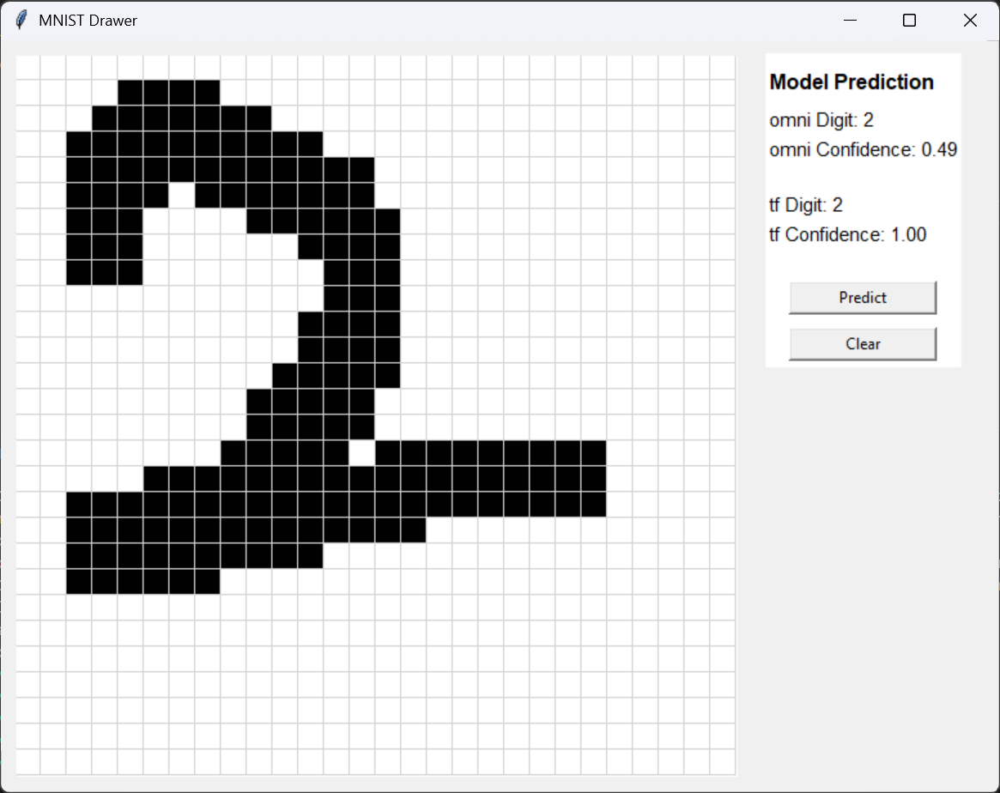
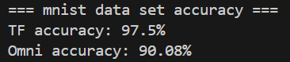

# OMNI


---

**OMNI** is an experimental **machine learning library** built entirely with **Python** and **NumPy**.  
It’s currently a **work in progress**, serving as both a learning project and a sandbox for exploring and implementing core machine learning concepts from scratch.

The goal of this project is to gain a deeper understanding of the mathematical and logical foundations behind machine learning algorithms - by building them from the ground up, without relying on high-level frameworks.

---

### 🚧 Current Status
OMNI is under active development.  
Expect frequent changes and experimental implementations as the library evolves.

---

### 💡 Vision
- Implement core ML algorithms from scratch using NumPy.  
- Focus on clarity, educational value, and mathematical correctness.  
- Gradually expand towards neural networks and optimization techniques.

---

### ✨ Features
- Custom neural network layers (Dense, activation functions)
- Manual forward and backward propagation
- Model training with mini-batch SGD
- Support for MSE and Cross-Entropy loss
- Model save/load functionality
- Playground for MNIST digit recognition (with GUI)

---

### ⚡ Installation
1. Clone the repository:
   ```powershell
   git clone https://github.com/musa-kal/omni-Neural-Network-Library.git
   cd omni-Neural-Network-Library
   ```
2. Install dependencies:
   ```powershell
   pip install -r omni_requirements.txt
   ```
   (For full playground support, use `full_requirements.txt`)

---

### � Building & Publishing as a PyPI Package

To build and publish OMNI to PyPI:

1. **Install build tools** (if not already installed):
   ```powershell
   pip install build twine
   ```

2. **Build the distribution packages**:
   ```powershell
   python -m build
   ```
   This creates `.whl` and `.tar.gz` files in the `dist/` folder.

3. **Install locally (for testing)**:
   
   **Option A: Editable install** (recommended for development):
   ```powershell
   pip install -e .
   ```
   Changes to the source code are reflected immediately without reinstalling.

   **Option B: Direct install from source**:
   ```powershell
   pip install .
   ```
   
   **Option C: Install from built wheel**:
   ```powershell
   pip install dist/omni-0.0.2-py3-none-any.whl
   ```

4. **Create a PyPI account**:
   - Sign up at [pypi.org](https://pypi.org)
   - Create an API token in your account settings

4. **Upload to PyPI**:
   ```powershell
   python -m twine upload dist/*
   ```
   - Username: `__token__`
   - Password: Your API token

6. **Install from PyPI**:
   Once published, anyone can install with:
   ```powershell
   pip install omni
   ```

---

### �🚀 Basic Usage Example
```python
import numpy as np
from omni import DenseLayer, Model, ActivationFunctions, Sequential

X = 2 * np.random.rand(100, 1)
y = 100 * (X - 1) ** 2 + np.random.randn(100, 1)

layers = Sequential(input_shape=(1,))
layers.join_front(DenseLayer(64, ActivationFunctions.Relu))
layers.join_front(DenseLayer(64, ActivationFunctions.Relu))
layers.join_front(DenseLayer(1))
model = Model(layers)
model.compile(loss_function=model.MSE)
model.fit(X, y, epoch=300, batch_size=16)
```

---

### 📁 Project Structure
- `src/omni/` - Core library code
- `playground/mnist/` - MNIST training, testing, and GUI demo
- `test_run.py` - Quick test script for regression
- `catalog/` - Images and results

---

### 🖼️ MNIST Playground
Train and test on MNIST using scripts in `playground/mnist/`:
- `train_mnist.py` - Train OMNI and TensorFlow models
- `test_mnist.py` - Evaluate accuracy
- `play.py` - Draw digits and compare predictions in a GUI
- 

---

### 🖼️ Omni VS TF Images
A small gallery of visualization outputs.

- 
- 
- 
- 


> ⚠️ This library is purely for learning and experimentation purposes.

